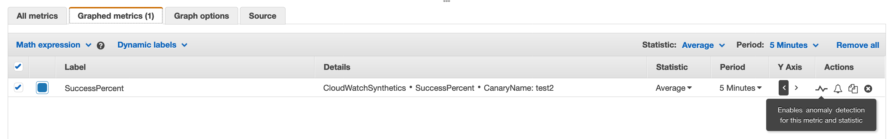

# Introduction
We will be creating a Canary to test this simple user submission form - http://addressupdater-2049029495.us-east-1.elb.amazonaws.com/ 

Navigate to the link, enter random text in firstname, lastname and address fields. Click on **Update address** button. Repeat it a few times and you will observe that the page randomly says *Unable to update address* which we consider as failure. Our goal is to create a Canary that will identify the failure scenarios and record results automatically.

# Create a Canary
1. Navigate to [CloudWatch Synthetics](https://console.aws.amazon.com/cloudwatch/home#synthetics:)
2. Click on **Canaries**
3. Click **Create Canary**

4. In the next screen, choose **Upload a Script** option

5. Download the [Canary.js](canary.js) file and save it in your local location
6. Click on **Browse files** and upload the file you downloaded earlier
7. Enter text **exports.handler** in the **Script entry point** textbox
8. Choose **once per minute** under **Run continuously** drop down. Ensure **Start immediately after creation** checkbox is checked

9. Leave **Data retention** option as it is
10. Under **Data Storage**, select an S3 bucket that you want the file to be uploaded to and Canary result data to be stored.
11. Under **Access permissions**, select **Create a new role** which will create a new IAM role for Canary execution.
12. Under **Alarms - optional**, select **Enable default alarms for this canary** option
13. Click **Create canary**
14. Wait for a minute or so for the Canary to start and execute. 

# Explore Canary results
1. Navigate to [Canaries home page](https://console.aws.amazon.com/cloudwatch/home#synthetics:canary/list)
2. Click on the Canary you created, which will take you to the **Summary** page

3. Change the durartion to **1 hr**
4. Based on the execution result status, you will see either Blue or Red dots.Blue indicates a successful respose, while Red indicates a failure scenario.
5. Click on a dot and check out the **Screenshots** tab. Scroll down to see all the scrrenshots the Canary took as part of the execution process.
6. Go to **HAR File** tab and check out the HTTP Archive data for the request and responses from the application
7. Go to **Logs** tab to see the details on each execution step. In particular, pay attention to how the error details as shown below. If you're exploring a failed result

8. Now go to **Metrics** tab at the top left. Here you will see the Lambda execution metric widgets. This shows details about the Lambda function that was executed as part of the Canary.
9.Navigate to **Configuration** tab and check out more details about the Canary and the Canary script
10. Go to [CloudWatch Metrics](https://console.aws.amazon.com/cloudwatch/home#metricsV2:). Click on **CloudWatchSynthetics** namespace
10.Click on any dimension to check out the metrics the Canary is publishing. As always, you can click on a metric to create line graphs and also setup Anomaly Detection by clicking on the graph icon

